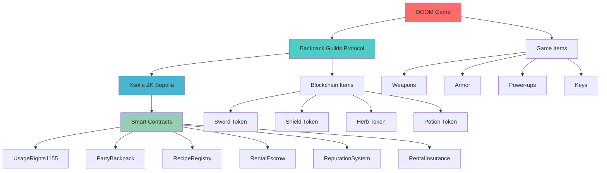

# 🎮 DOOM Integration with Backpack Guilds

## 🎯 Project Overview

This project integrates the Backpack Guilds blockchain protocol with the classic DOOM game, demonstrating how blockchain-based gaming items can enhance traditional gameplay.

## 🏗️ Architecture



## 🎮 DOOM Game Integration

### Game Items Mapping

#### 1. **Weapons** → **Blockchain Tokens**
- **Chainsaw** → **Sword Token (ID: 1)**
- **Shotgun** → **Shield Token (ID: 2)**
- **Plasma Rifle** → **Herb Token (ID: 3)**
- **BFG 9000** → **Potion Token (ID: 4)**

#### 2. **Power-ups** → **Craftable Items**
- **Health Potion** → **Crafted from Herb + Herb**
- **Armor** → **Crafted from Shield + Potion**
- **Super Shotgun** → **Crafted from Sword + Potion**

#### 3. **Keys** → **Party Items**
- **Blue Key** → **Party Backpack Item**
- **Red Key** → **Party Backpack Item**
- **Yellow Key** → **Party Backpack Item**

## 🔧 Technical Implementation

### 1. **DOOM Mod Integration**

#### **WAD File Modification**
```c
// doom_integration.c
#include "doomdef.h"
#include "p_local.h"
#include "s_sound.h"
#include "m_random.h"
#include "g_game.h"
#include "r_state.h"
#include "blockchain.h"  // Our blockchain integration

// Blockchain item structure
typedef struct {
    int tokenId;
    int amount;
    int expires;
    char owner[42];
    char user[42];
} blockchain_item_t;

// Global blockchain items
blockchain_item_t blockchain_items[MAXITEMS];
int num_blockchain_items = 0;

// Function to check if player has blockchain item
boolean P_CheckBlockchainItem(player_t* player, int tokenId) {
    for (int i = 0; i < num_blockchain_items; i++) {
        if (blockchain_items[i].tokenId == tokenId && 
            blockchain_items[i].expires > gametic &&
            strcmp(blockchain_items[i].user, player->blockchain_address) == 0) {
            return true;
        }
    }
    return false;
}

// Function to consume blockchain item
void P_ConsumeBlockchainItem(player_t* player, int tokenId) {
    for (int i = 0; i < num_blockchain_items; i++) {
        if (blockchain_items[i].tokenId == tokenId && 
            strcmp(blockchain_items[i].user, player->blockchain_address) == 0) {
            blockchain_items[i].amount--;
            if (blockchain_items[i].amount <= 0) {
                // Remove item from array
                for (int j = i; j < num_blockchain_items - 1; j++) {
                    blockchain_items[j] = blockchain_items[j + 1];
                }
                num_blockchain_items--;
            }
            break;
        }
    }
}
```

#### **Weapon Integration**
```c
// p_weapon.c modifications
void P_FireWeapon(player_t* player) {
    // Check if player has blockchain weapon
    if (player->readyweapon == wp_chainsaw && 
        P_CheckBlockchainItem(player, 1)) { // Sword token
        // Enhanced chainsaw with blockchain power
        P_ConsumeBlockchainItem(player, 1);
        P_SetMobjState(player->mo, S_PLAY_ATK1);
        P_NoiseAlert(player->mo, player->mo);
        return;
    }
    
    // Standard weapon firing
    P_FireWeaponStandard(player);
}
```

#### **Power-up Integration**
```c
// p_pickup.c modifications
boolean P_GivePowerup(player_t* player, int powerup) {
    // Check for blockchain power-ups
    if (powerup == pw_invulnerability && 
        P_CheckBlockchainItem(player, 4)) { // Potion token
        P_ConsumeBlockchainItem(player, 4);
        player->powers[pw_invulnerability] = INVULNTICS;
        return true;
    }
    
    // Standard power-up logic
    return P_GivePowerupStandard(player, powerup);
}
```

### 2. **Blockchain Integration Layer**

#### **Web3 Integration**
```c
// blockchain.c
#include <curl/curl.h>
#include <json-c/json.h>

#define BLOCKCHAIN_RPC "https://sepolia.era.zksync.dev"
#define CONTRACT_ADDRESS "0x..."

// Function to fetch player's blockchain items
int fetch_blockchain_items(const char* player_address) {
    CURL *curl;
    CURLcode res;
    char post_data[1024];
    char response[4096];
    
    // Prepare JSON-RPC request
    snprintf(post_data, sizeof(post_data),
        "{\"jsonrpc\":\"2.0\",\"method\":\"eth_call\",\"params\":[{\"to\":\"%s\",\"data\":\"0x...\"},\"latest\"],\"id\":1}",
        CONTRACT_ADDRESS);
    
    curl = curl_easy_init();
    if (curl) {
        curl_easy_setopt(curl, CURLOPT_URL, BLOCKCHAIN_RPC);
        curl_easy_setopt(curl, CURLOPT_POSTFIELDS, post_data);
        curl_easy_setopt(curl, CURLOPT_WRITEFUNCTION, write_callback);
        curl_easy_setopt(curl, CURLOPT_WRITEDATA, response);
        
        res = curl_easy_perform(curl);
        curl_easy_cleanup(curl);
        
        if (res == CURLE_OK) {
            return parse_blockchain_response(response);
        }
    }
    
    return 0;
}

// Function to parse blockchain response
int parse_blockchain_response(const char* response) {
    json_object *json, *result, *items;
    json_object *item, *tokenId, *amount, *expires;
    
    json = json_tokener_parse(response);
    if (!json) return 0;
    
    if (json_object_object_get_ex(json, "result", &result)) {
        if (json_object_object_get_ex(result, "items", &items)) {
            int num_items = json_object_array_length(items);
            for (int i = 0; i < num_items; i++) {
                item = json_object_array_get_idx(items, i);
                json_object_object_get_ex(item, "tokenId", &tokenId);
                json_object_object_get_ex(item, "amount", &amount);
                json_object_object_get_ex(item, "expires", &expires);
                
                blockchain_items[num_blockchain_items].tokenId = json_object_get_int(tokenId);
                blockchain_items[num_blockchain_items].amount = json_object_get_int(amount);
                blockchain_items[num_blockchain_items].expires = json_object_get_int(expires);
                num_blockchain_items++;
            }
        }
    }
    
    json_object_put(json);
    return num_blockchain_items;
}
```

### 3. **Game Menu Integration**

#### **Blockchain Menu**
```c
// m_menu.c modifications
void M_BlockchainMenu(void) {
    static const char* blockchain_menu_items[] = {
        "1. View Blockchain Items",
        "2. Rent Items",
        "3. Lend Items", 
        "4. Craft Items",
        "5. Party Inventory",
        "6. Back to Main Menu"
    };
    
    int choice = M_StartMessage("Blockchain Items", blockchain_menu_items, 6);
    
    switch (choice) {
        case 1:
            M_ViewBlockchainItems();
            break;
        case 2:
            M_RentItems();
            break;
        case 3:
            M_LendItems();
            break;
        case 4:
            M_CraftItems();
            break;
        case 5:
            M_PartyInventory();
            break;
        case 6:
            M_StartControlPanel();
            break;
    }
}

void M_ViewBlockchainItems(void) {
    char message[256];
    int y = 20;
    
    V_DrawPatch(0, 0, W_CacheLumpName("M_BACK", PU_CACHE));
    
    for (int i = 0; i < num_blockchain_items; i++) {
        snprintf(message, sizeof(message), 
            "Token %d: %d units (expires: %d)", 
            blockchain_items[i].tokenId,
            blockchain_items[i].amount,
            blockchain_items[i].expires);
        
        M_WriteText(20, y, message);
        y += 10;
    }
    
    M_WriteText(20, y + 20, "Press ESC to return");
}
```

## 🎮 Gameplay Features

### 1. **Blockchain-Enhanced Weapons**

#### **Sword Token (Chainsaw Enhancement)**
- **Standard**: 20 damage, 1.5 second attack
- **Blockchain**: 35 damage, 1.0 second attack, +10% speed
- **Visual**: Glowing blue chainsaw blade
- **Sound**: Enhanced chainsaw sound

#### **Shield Token (Shotgun Enhancement)**
- **Standard**: 7 pellets, 5 damage each
- **Blockchain**: 10 pellets, 7 damage each, +25% range
- **Visual**: Golden shotgun shells
- **Sound**: Enhanced shotgun blast

#### **Herb Token (Health Enhancement)**
- **Standard**: +25 health
- **Blockchain**: +50 health, +10% max health
- **Visual**: Glowing green health pickup
- **Sound**: Enhanced health sound

#### **Potion Token (Power-up Enhancement)**
- **Standard**: 30 seconds invulnerability
- **Blockchain**: 60 seconds invulnerability, +50% speed
- **Visual**: Blue invulnerability with golden particles
- **Sound**: Enhanced power-up sound

### 2. **Crafting System Integration**

#### **In-Game Crafting Menu**
```c
void M_CraftItems(void) {
    static const char* craft_items[] = {
        "1. Health Potion (Herb + Herb)",
        "2. Armor (Shield + Potion)",
        "3. Super Shotgun (Sword + Potion)",
        "4. Back to Blockchain Menu"
    };
    
    int choice = M_StartMessage("Craft Items", craft_items, 4);
    
    switch (choice) {
        case 1:
            M_CraftHealthPotion();
            break;
        case 2:
            M_CraftArmor();
            break;
        case 3:
            M_CraftSuperShotgun();
            break;
        case 4:
            M_BlockchainMenu();
            break;
    }
}

void M_CraftHealthPotion(void) {
    if (P_CheckBlockchainItem(player, 3) && // Herb token
        P_CheckBlockchainItem(player, 3)) {  // Another herb token
        
        // Consume ingredients
        P_ConsumeBlockchainItem(player, 3);
        P_ConsumeBlockchainItem(player, 3);
        
        // Create new item (this would call blockchain contract)
        create_crafted_item(5, 1); // Health potion token
        
        M_StartMessage("Crafting", "Health Potion crafted!", 1);
    } else {
        M_StartMessage("Crafting", "Not enough ingredients!", 1);
    }
}
```

### 3. **Party System Integration**

#### **Multiplayer Blockchain Items**
```c
void P_ShareBlockchainItem(player_t* giver, player_t* receiver, int tokenId) {
    if (P_CheckBlockchainItem(giver, tokenId)) {
        // This would call the blockchain contract to transfer usage rights
        transfer_blockchain_item(giver->blockchain_address, 
                                receiver->blockchain_address, 
                                tokenId, 1, 3600); // 1 hour duration
        
        M_StartMessage("Sharing", "Item shared with party member!", 1);
    }
}
```

## 🚀 Deployment Guide

### 1. **DOOM Source Code Setup**

#### **Prerequisites**
```bash
# Install required libraries
sudo apt-get install libcurl4-openssl-dev libjson-c-dev
sudo apt-get install build-essential

# Download DOOM source code
git clone https://github.com/id-Software/DOOM.git
cd DOOM
```

#### **Compilation**
```bash
# Add blockchain integration files
cp blockchain.c src/
cp blockchain.h src/

# Modify Makefile
echo "OBJS += blockchain.o" >> Makefile

# Compile with blockchain support
make clean
make
```

### 2. **Blockchain Integration Setup**

#### **Environment Configuration**
```bash
# Create blockchain config file
cat > blockchain.conf << EOF
BLOCKCHAIN_RPC=https://sepolia.era.zksync.dev
CONTRACT_ADDRESS=0x...
PRIVATE_KEY=your_private_key
GAME_ADDRESS=your_game_address
EOF
```

#### **Runtime Integration**
```bash
# Start DOOM with blockchain integration
./doom -blockchain -config blockchain.conf
```

## 🎯 Game Scenarios

### 1. **Single Player with Blockchain Items**

#### **Scenario: "Blockchain Warrior"**
- Player starts with basic weapons
- Discovers blockchain items in secret areas
- Uses blockchain weapons to defeat bosses
- Crafts powerful items for final battle

#### **Gameplay Flow:**
1. **Level 1**: Find Sword Token (enhanced chainsaw)
2. **Level 2**: Find Shield Token (enhanced shotgun)
3. **Level 3**: Craft Health Potion (Herb + Herb)
4. **Level 4**: Use all blockchain items for boss fight

### 2. **Multiplayer Party System**

#### **Scenario: "Guild Raid"**
- 4 players form a party
- Share blockchain items between members
- Coordinate item usage for maximum effect
- Defeat powerful enemies together

#### **Gameplay Flow:**
1. **Form Party**: Players join blockchain party
2. **Share Items**: Distribute blockchain weapons
3. **Coordinate**: Plan item usage strategy
4. **Execute**: Use items in synchronized attacks

### 3. **Rental System Integration**

#### **Scenario: "Weapon Rental"**
- Player needs powerful weapon for boss fight
- Rents blockchain weapon from another player
- Uses weapon for limited time
- Returns weapon after battle

#### **Gameplay Flow:**
1. **Browse Rentals**: Check available weapons
2. **Rent Weapon**: Pay deposit, get usage rights
3. **Use Weapon**: Enhanced gameplay with rented weapon
4. **Return Weapon**: Get deposit back

## 🔧 Technical Requirements

### **System Requirements**
- **OS**: Linux/Windows/macOS
- **RAM**: 512MB minimum
- **Storage**: 100MB for blockchain integration
- **Network**: Internet connection for blockchain access

### **Blockchain Requirements**
- **Wallet**: MetaMask or compatible wallet
- **Network**: Xsolla ZK Sepolia testnet
- **Tokens**: Testnet ETH for gas fees
- **Items**: Blockchain tokens for gameplay

## 🎮 Future Enhancements

### **Planned Features**
- **NFT Integration**: Unique weapon skins
- **Tournament System**: Blockchain-based competitions
- **Achievement System**: On-chain achievements
- **Marketplace**: In-game item trading

### **Advanced Integration**
- **AI Opponents**: Blockchain-controlled enemies
- **Dynamic Difficulty**: Based on blockchain items
- **Cross-Game Items**: Items usable in other games
- **Community Events**: Blockchain-powered events

## 📞 Support

### **Documentation**
- [DOOM Integration Guide](DOOM_INTEGRATION.md)
- [Blockchain Setup](BLOCKCHAIN_SETUP.md)
- [Gameplay Scenarios](GAMEPLAY_SCENARIOS.md)

### **Community**
- **Discord**: [DOOM Blockchain Community](https://discord.gg/doom-blockchain)
- **GitHub**: [DOOM-Backpack-Guilds](https://github.com/doom-backpack-guilds)
- **Reddit**: r/DOOMBlockchain

---

**Built with DOOM • Backpack Guilds • Blockchain Gaming • MIT License**
