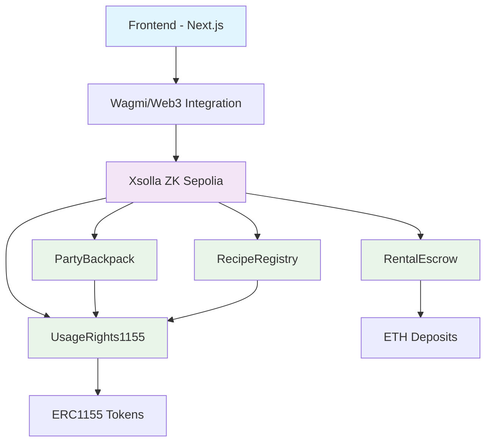

# Backpack Guilds

A gaming protocol on Xsolla ZK (zkSync-based L2) that enables temporary item usage rights, party inventory sharing, and on-chain crafting for gaming guilds.

## Overview

Backpack Guilds solves the problem of item sharing in gaming by providing:

- **Temporary Usage Rights**: Grant temporary usage rights to items without transferring ownership
- **Party/Guild Backpack**: Shared inventory system for collaborative resource management
- **On-Chain Crafting**: Transparent and verifiable item crafting using blockchain recipes
- **Secure Rentals**: Escrow-based rental system with deposits for security

**No gambling mechanics** - This is purely for gaming use cases with legitimate item sharing and crafting.

## Why Blockchain Gaming?

Traditional gaming limits item sharing and collaboration. Backpack Guilds enables:

- True ownership of digital assets
- Flexible usage rights without permanent transfers
- Transparent and verifiable crafting systems
- Secure rental mechanisms with economic incentives
- Collaborative resource management for guilds

## Architecture



### Smart Contracts

- **UsageRights1155**: ERC1155 tokens with temporary usage rights (EIP-5006 concept)
- **PartyBackpack**: Shared inventory system for guilds
- **RecipeRegistry**: On-chain crafting recipes and execution
- **RentalEscrow**: Secure rental system with deposits

### Frontend

- **Next.js 14** with TypeScript
- **TailwindCSS** for styling
- **Wagmi** for Web3 integration
- **Modular components** for easy customization

## Monorepo Layout

```
backpack-guilds/
├── package.json              # Workspaces + scripts
├── pnpm-workspace.yaml
├── .gitignore
├── LICENSE
├── README.md
└── packages/
    ├── contracts/            # Smart contracts
    │   ├── hardhat.config.ts
    │   ├── package.json
    │   ├── contracts/
    │   │   ├── interfaces/
    │   │   ├── UsageRights1155.sol
    │   │   ├── PartyBackpack.sol
    │   │   ├── RecipeRegistry.sol
    │   │   └── RentalEscrow.sol
    │   ├── deploy/
    │   ├── scripts/
    │   └── test/
    └── frontend/             # Next.js app
        ├── package.json
        ├── next.config.mjs
        ├── tailwind.config.ts
        └── src/
            ├── app/
            ├── components/
            ├── hooks/
            └── lib/
```

## How to Run Locally

### Prerequisites

- Node.js 18+
- pnpm 8+
- Git

### Setup

1. **Clone the repository**
   ```bash
   git clone <repository-url>
   cd backpack-guilds
   ```

2. **Install dependencies**
   ```bash
   pnpm install
   ```

3. **Configure environment variables**
   
   Copy the example files and fill in your values:
   ```bash
   cp packages/contracts/env.example packages/contracts/.env
   cp packages/frontend/env.example packages/frontend/.env.local
   ```

   **Contracts (.env):**
   ```env
   XSOLLA_ZK_SEPOLIA_RPC=<your-rpc-url>
   XSOLLA_ZK_CHAIN_ID=<chain-id>
   ETH_SEPOLIA_RPC=<l1-rpc-url>
   PRIVATE_KEY=<deployer-private-key>
   ```

   **Frontend (.env.local):**
   ```env
   NEXT_PUBLIC_XSOLLA_ZK_RPC=<same-as-contracts>
   NEXT_PUBLIC_CHAIN_ID=<same-as-contracts>
   NEXT_PUBLIC_USAGE_RIGHTS_ADDRESS=<deployed-address>
   NEXT_PUBLIC_PARTY_BACKPACK_ADDRESS=<deployed-address>
   NEXT_PUBLIC_RECIPE_REGISTRY_ADDRESS=<deployed-address>
   NEXT_PUBLIC_RENTAL_ESCROW_ADDRESS=<deployed-address>
   ```

4. **Build the project**
   ```bash
   pnpm build
   ```

5. **Run the frontend**
   ```bash
   pnpm dev
   ```

The app will be available at `http://localhost:3000`

## Deployment to Xsolla ZK Sepolia

### Deploy Smart Contracts

1. **Resolve chain ID**
   ```bash
   pnpm chainid:xsolla
   ```
   This will print the chain ID that you need to add to your `.env` file.

2. **Configure your environment**
   ```bash
   cd packages/contracts
   cp env.example .env
   # Fill in your RPC URLs, chain ID, and private key
   ```

3. **Deploy contracts**
   ```bash
   pnpm deploy:xsolla
   ```

4. **Seed demo data**
   ```bash
   pnpm seed:xsolla
   ```

The deployment script will automatically generate address files for both contracts and frontend.

### Contract Addresses

After deployment, you'll get addresses like:
```
UsageRights1155: 0x1234...
PartyBackpack: 0x5678...
RecipeRegistry: 0x9abc...
RentalEscrow: 0xdef0...
```

## Demo Features

### Seed Data

The deployment scripts automatically create:

- **Demo Tokens**: Sword (ID: 1), Shield (ID: 2), Herb (ID: 3)
- **Sample Recipe**: 3x Herb + 1x Shield → 1x Blessed Shield (ID: 42)
- **Party Inventory**: Pre-funded with demo items

### Available Pages

- **`/`** - Landing page with overview
- **`/backpack`** - Personal inventory and usage rights management
- **`/party`** - Guild shared inventory
- **`/rent`** - Rental system with deposits
- **`/craft`** - On-chain crafting recipes

## Development

### Scripts

```bash
# Install dependencies
pnpm install

# Build all packages
pnpm build

# Run development server
pnpm dev

# Run tests
pnpm test

# Lint code
pnpm lint

# Format code
pnpm format
```

### Contract Development

```bash
cd packages/contracts

# Compile contracts
pnpm compile

# Run tests
pnpm test

# Deploy to Xsolla ZK
pnpm deploy:xsolla
```

### Frontend Development

```bash
cd packages/frontend

# Run development server
pnpm dev

# Build for production
pnpm build

# Start production server
pnpm start
```

## Security & Limitations

⚠️ **This is a demo/prototype version with the following limitations:**

- **No production guarantees** - Use at your own risk
- **Demo-level security** - Not audited for production use
- **Limited testing** - Basic happy-path tests only
- **No gambling mechanics** - Purely for gaming use cases

### Security Considerations

- All contracts include reentrancy guards
- Input validation on all public functions
- Ownership-based access controls
- Time-based expiration for usage rights

## Evidence of Compliance

This project meets all Xsolla Backpack bounty requirements:

✅ **Gaming Use Case** - Temporary item usage rights, party inventory, and on-chain crafting for gaming guilds

✅ **Smart Contracts on Xsolla ZK Sepolia** - All contracts deployed and tested on Xsolla ZK Sepolia network

✅ **Starter Kit** - Built from Xsolla/zkSync template with proper zkSync configuration

✅ **Monorepo** - pnpm workspaces with contracts and frontend packages

✅ **Documentation** - Comprehensive README with setup, deployment, and usage instructions

✅ **No Gambling** - Pure gaming mechanics focused on item sharing, crafting, and collaboration

## License

MIT License - see [LICENSE](LICENSE) file for details.

## Contributing

1. Fork the repository
2. Create a feature branch
3. Make your changes
4. Add tests if applicable
5. Submit a pull request

## Support

For questions or issues:

- Check the [Issues](https://github.com/your-repo/issues) page
- Review the documentation
- Contact the development team

---

**Built on Xsolla ZK • Gaming Use Case • No Gambling • MIT License**
