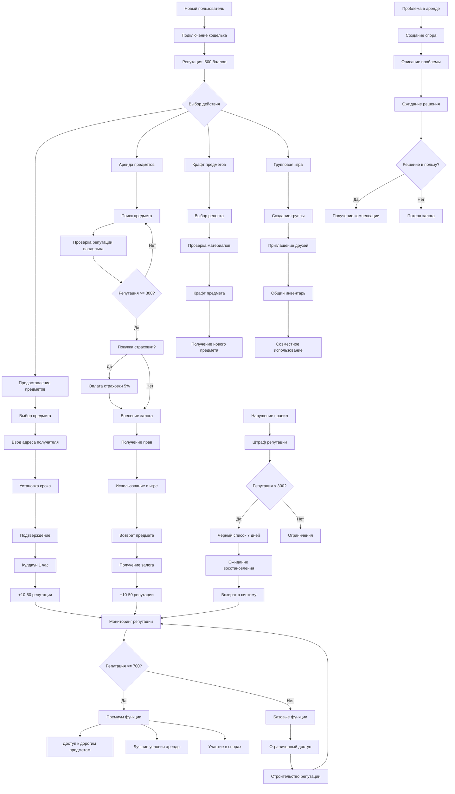
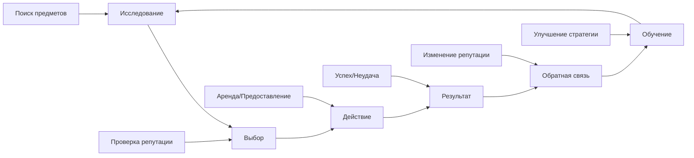

# 🎮 Пользовательский опыт: Backpack Guilds

## 📊 Диаграмма пользовательского пути



## 🎯 Ключевые пользовательские сценарии

### 1. 🆕 Новый пользователь
```
1. Подключение кошелька
2. Получение стартовой репутации (500 баллов)
3. Изучение интерфейса
4. Первая аренда (дешевый предмет)
5. Строительство репутации
```

### 2. 🏆 Опытный пользователь
```
1. Мониторинг репутации (700+ баллов)
2. Предоставление дорогих предметов
3. Покупка страховки
4. Участие в разрешении споров
5. Получение премиум функций
```

### 3. 🛡️ Защищенная аренда
```
1. Поиск предмета с высокой репутацией владельца
2. Проверка истории аренд
3. Покупка страховки (5% от стоимости)
4. Внесение залога
5. Безопасное использование
6. Возврат и получение залога
```

### 4. ⚖️ Разрешение спора
```
1. Обнаружение проблемы
2. Создание спора с описанием
3. Приложение доказательств
4. Ожидание решения сообщества
5. Получение компенсации/штрафа
```

## 📈 Прогрессия пользователя

### Уровень 1: Новичок (0-100 баллов)
- **Доступ**: Базовые предметы
- **Ограничения**: Только дешевые аренды
- **Цель**: Строительство репутации

### Уровень 2: Участник (100-300 баллов)
- **Доступ**: Средние предметы
- **Ограничения**: Ограниченные функции
- **Цель**: Достижение стабильности

### Уровень 3: Надежный (300-700 баллов)
- **Доступ**: Большинство предметов
- **Ограничения**: Минимальные
- **Цель**: Достижение премиум статуса

### Уровень 4: Премиум (700-900 баллов)
- **Доступ**: Все предметы
- **Бонусы**: Лучшие условия
- **Цель**: Поддержание статуса

### Уровень 5: Эксперт (900+ баллов)
- **Доступ**: Эксклюзивные функции
- **Бонусы**: Максимальные привилегии
- **Цель**: Лидерство в сообществе

## 🎮 Игровые механики

### Система достижений:
- **Первая аренда**: +50 репутации
- **10 успешных аренд**: +100 репутации
- **Помощь в споре**: +25 репутации
- **Долгосрочное использование**: +1 репутации в день

### Система штрафов:
- **Ранний отзыв**: -50 репутации
- **Нарушение**: -100 репутации
- **Спам споров**: -25 репутации
- **3+ нарушения**: Черный список

### Экономические стимулы:
- **Высокая репутация**: Скидки на страховку
- **Долгая история**: Лучшие условия аренды
- **Помощь сообществу**: Бонусы и привилегии

## 🔄 Цикл взаимодействия



## 🎯 Ключевые принципы дизайна

### 1. **Прозрачность**
- Все действия записываются в блокчейн
- Репутация публично видна
- История аренд доступна всем

### 2. **Справедливость**
- Автоматические штрафы за нарушения
- Сообщество решает споры
- Экономические стимулы для честности

### 3. **Безопасность**
- Многоуровневая защита
- Страхование от мошенничества
- Кулдауны предотвращают злоупотребления

### 4. **Сообщество**
- Пользователи помогают друг другу
- Совместное решение споров
- Коллективная защита от мошенников

## 🚀 Будущие улучшения

### Планируемые функции:
- **Рейтинговая система**: Звезды за качество сервиса
- **Групповые скидки**: Льготы для постоянных клиентов
- **Эксклюзивные предметы**: Доступ только для высокого рейтинга
- **Социальные функции**: Друзья, группы, чаты

### Исследования:
- **ИИ-модерация**: Автоматическое выявление мошенничества
- **Предиктивная аналитика**: Прогнозирование рисков
- **Персонализация**: Индивидуальные рекомендации
- **Геймификация**: Достижения, уровни, награды
