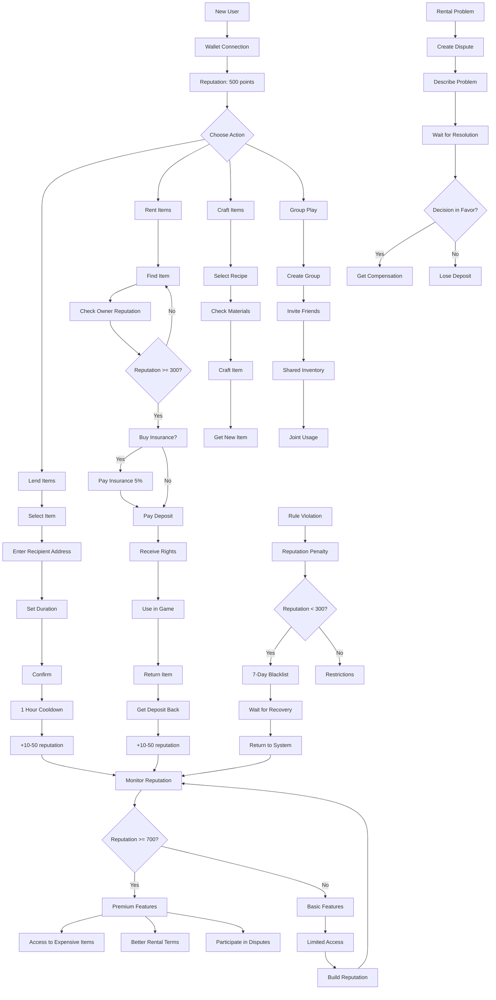
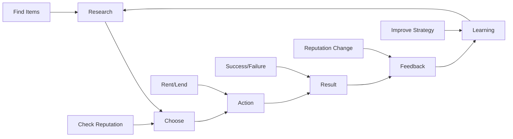

# 🎮 User Experience: Backpack Guilds

## 📊 User Journey Diagram



## 🎯 Key User Scenarios

### 1. 🆕 New User
```
1. Wallet connection
2. Get starting reputation (500 points)
3. Explore interface
4. First rental (cheap item)
5. Build reputation
```

### 2. 🏆 Experienced User
```
1. Monitor reputation (700+ points)
2. Lend expensive items
3. Buy insurance
4. Participate in dispute resolution
5. Get premium features
```

### 3. 🛡️ Protected Rental
```
1. Find item with high owner reputation
2. Check rental history
3. Buy insurance (5% of cost)
4. Pay deposit
5. Safe usage
6. Return and get deposit back
```

### 4. ⚖️ Dispute Resolution
```
1. Detect problem
2. Create dispute with description
3. Attach evidence
4. Wait for community decision
5. Get compensation/penalty
```

## 📈 User Progression

### Level 1: Beginner (0-100 points)
- **Access**: Basic items
- **Restrictions**: Only cheap rentals
- **Goal**: Build reputation

### Level 2: Participant (100-300 points)
- **Access**: Medium items
- **Restrictions**: Limited features
- **Goal**: Achieve stability

### Level 3: Reliable (300-700 points)
- **Access**: Most items
- **Restrictions**: Minimal
- **Goal**: Achieve premium status

### Level 4: Premium (700-900 points)
- **Access**: All items
- **Bonuses**: Better terms
- **Goal**: Maintain status

### Level 5: Expert (900+ points)
- **Access**: Exclusive features
- **Bonuses**: Maximum privileges
- **Goal**: Community leadership

## 🎮 Gaming Mechanics

### Achievement System:
- **First rental**: +50 reputation
- **10 successful rentals**: +100 reputation
- **Help in dispute**: +25 reputation
- **Long-term usage**: +1 reputation per day

### Penalty System:
- **Early revoke**: -50 reputation
- **Violation**: -100 reputation
- **Dispute spam**: -25 reputation
- **3+ violations**: Blacklist

### Economic Incentives:
- **High reputation**: Insurance discounts
- **Long history**: Better rental terms
- **Community help**: Bonuses and privileges

## 🔄 Interaction Cycle



## 🎯 Key Design Principles

### 1. **Transparency**
- All actions recorded on blockchain
- Reputation publicly visible
- Rental history available to all

### 2. **Fairness**
- Automatic penalties for violations
- Community decides disputes
- Economic incentives for honesty

### 3. **Security**
- Multi-level protection
- Insurance against fraud
- Cooldowns prevent abuse

### 4. **Community**
- Users help each other
- Joint dispute resolution
- Collective protection against fraudsters

## 🚀 Future Improvements

### Planned Features:
- **Rating system**: Stars for service quality
- **Group discounts**: Benefits for regular customers
- **Exclusive items**: Access only for high rating
- **Social features**: Friends, groups, chats

### Research Areas:
- **AI moderation**: Automatic fraud detection
- **Predictive analytics**: Risk forecasting
- **Personalization**: Individual recommendations
- **Gamification**: Achievements, levels, rewards
